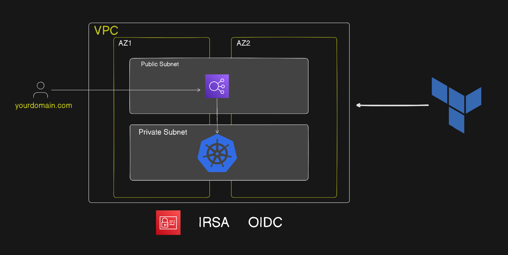
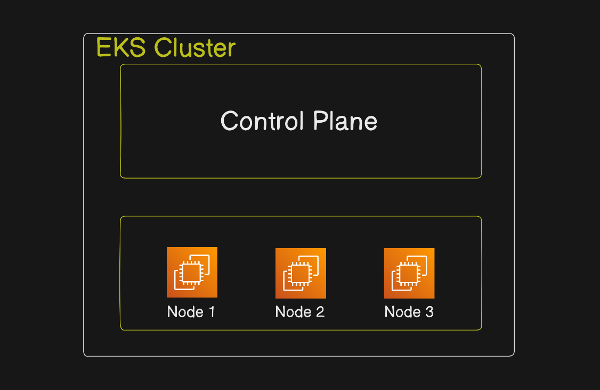
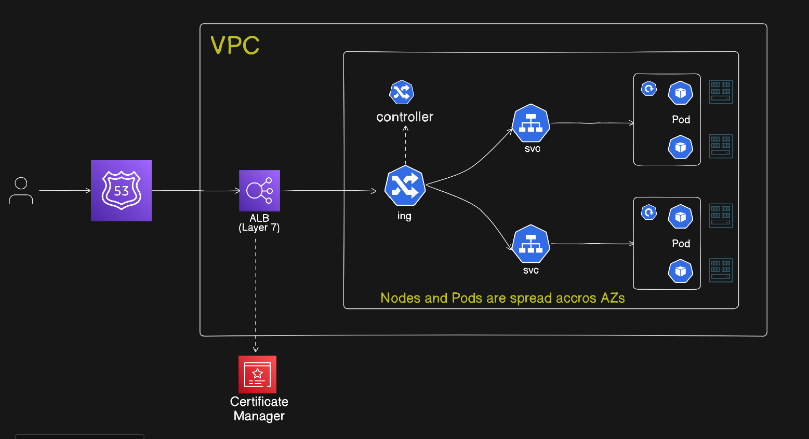

# **Production-Grade AWS EKS Deployment with ALB, TLS & Route53 (Terraform Automated)**

## 📌 Overview

This project provisions a production-ready private Amazon EKS cluster using Infrastructure as Code (Terraform) and deploys microservices using Kubernetes with:

- AWS Load Balancer Controller (ALB)

- Kubernetes Ingress

- TLS termination using ACM

- Route53 DNS configuration

- Host-based routing

- Bastion host for secure access

The entire infrastructure layer is automated using Terraform.

## Architecture
Core AWS Services Used
- Amazon Web Services
- Amazon EKS
- AWS Application Load Balancer
- Amazon Route 53
- AWS Certificate Manager





## Infrastructure Provisioned with Terraform
### Networking (Custom VPC)
- VPC
- Public Subnets
- Private Subnets
- Internet Gateway (IGW)
- NAT Gateway
- Route Tables
- Security Groups

#### Architecture model:
```
Public Subnet:
  - Bastion Host
  - NAT Gateway
  - ALB

Private Subnet:
  - EKS Worker Nodes
```

### Private EKS Cluster
- Private Endpoint Enabled
- IAM Roles & Policies
- OIDC Provider
- IRSA (IAM Roles for Service Accounts)
- Managed Node Groups

#### Security-first design:
- No public access to worker nodes
- Access only via Bastion host

### Bastion Host
Used for:
- Secure SSH access
- Kubectl access to private cluster
- Helm installation
- Controller installation

**Steps to Clone and Run the Project**

**1. Create a Local Folder**

Create a folder in your local directory named production-eks.

**2. Clone the Repository**

Open VS Code (or Git Bash) and clone the repository:

git clone https://github.com/harathi-mutyam/PRODUCTION-EKS.git

**3. After Cloning the Repository**

Make the following changes:

Update the region in dev.tfvars based on the location where you want to create your infrastructure (such as EKS, VPC, etc.).

Example:

region = "us-east-1"

Ensure the region in backend.tf matches the region where your Terraform state storage (for example, an S3 bucket) is hosted.

**4. Navigate to the Terraform Directory**

Always run Terraform commands from the folder where main.tf exists:

cd eks-project/terraform/eks

**5. Verify Terraform Installation**

terraform version

**6. Initialize Terraform**

terraform init

**validate the terraform code**

terraform validate

**7. Plan the Infrastructure**

terraform plan -var-file="dev.tfvars"

**8. Apply the Changes**

terraform apply -var-file="dev.tfvars"


## Post-Provisioning Setup (Inside Bastion Host)
After Terraform completes:

#### Step 1: Configure AWS CLI
```
aws configure
```
Verify cluster:
```
aws eks update-kubeconfig --region <region> --name <cluster-name>
kubectl get nodes
```

#### Step 2: Install Helm
```bash
curl -fsSL -o get_helm.sh https://raw.githubusercontent.com/helm/helm/main/scripts/get-helm-3
chmod 700 get_helm.sh
./get_helm.sh
```

#### Step 3: Install AWS Load Balancer Controller
```bash
helm repo add eks https://aws.github.io/eks-charts
helm repo update
```

```
helm install aws-load-balancer-controller eks/aws-load-balancer-controller \
  -n kube-system \
  --set clusterName=<cluster-name> \
  --set region=<region> \
  --set vpcId=<vpcID> \
  --set serviceAccount.annotations."eks\.amazonaws\.com/role-arn"=<aws loadbalancer controller role>
```
verify:
```
kubectl get deployment -n kube-system aws-load-balancer-controller

kubectl get sa -n kube-system | grep load
```

## Application Deployment
All services are deployed as:

- Deployment
- ClusterIP Service
Deploy: 
```
kubectl apply -f ns.yaml
kubectl apply -f cart.yaml
kubectl apply -f product.yaml
kubectl apply -f payments.yaml
```

## Ingress Configuration

### Phase 1: HTTP Deployment
create:
```
kubectl apply -f ingress.yaml
```

Ingress annotations include:
- ALB scheme (internet-facing)
- Target type (ip)
- Listener: HTTP (port 80)

ALB is automatically provisioned by AWS Load Balancer Controller.

**Test using ALB DNS name.**

### Phase 2: Enable TLS (Production Setup)
#### Step 1: Create Hosted Zone
Using:
- Amazon Route 53

Create public hosted zone:
```
example.com
```

#### Step 2: Create ACM Certificate
Using:
- AWS Certificate Manager


#### Step 3: Update Ingress for TLS
Add Annotations:
```
alb.ingress.kubernetes.io/listen-ports: '[{"HTTPS": 443}, {"HTTP": 80}]'
alb.ingress.kubernetes.io/certificate-arn: <certificate arn>
alb.ingress.kubernetes.io/ssl-redirect: '443'
```
Reapply:
```
kubectl apply -f ingress.yaml
```

### Phase 3: Host-Based Routing
Final Production Routing:

| Host                 | Service          |
| -------------------- | ---------------- |
| cart.example.com     | cart service     |
| product.example.com  | product service  |
| payments.example.com | payments service |

Ingress rules:
```
rules:
  - host: cart.example.com
  - host: product.example.com
  - host: payments.example.com
```
ALB routes traffic based on host headers.

### Traffic Flow
<image src='./images/traffic.png'>


## **Cleanup**
To destroy infrastructure:
```
terraform destroy
```


